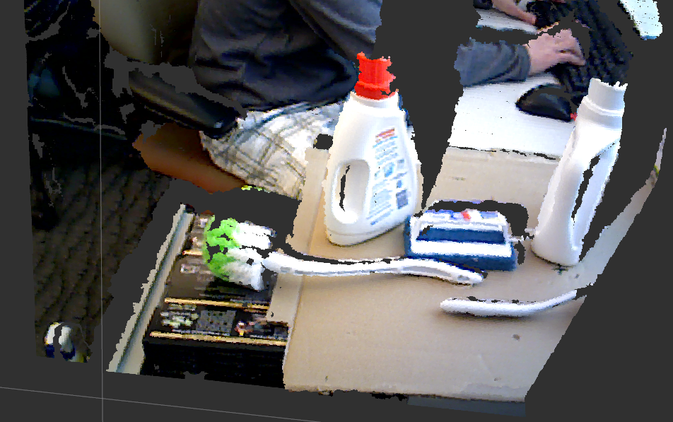
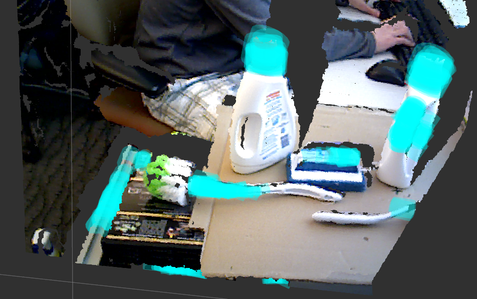

# Handle Detector

**Original author:** Andreas ten Pas (atp@ccs.neu.edu)

**Version:** 1.3.1-rail

**Original wiki:** http://wiki.ros.org/handle_detector

**Original author's website:** http://www.ccs.neu.edu/home/atp/

**Maintainer:** Ryan Petschek (petschekr@gatech.edu)

## Overview

This package takes a point cloud as input and produces a list of handels / enveloping grasp affordances as output. Also publishes the correctly located and oriented transforms of detected handles.

### Input: point cloud

### Output: handles / enveloping grasp affordances

## Requirements

1. ROS Indigo (http://wiki.ros.org/indigo)
2. Lapack (install in Ubuntu using: `sudo apt-get install liblapack-dev`)
3. A Kinect library like libfreenect2 or OpenNI that publishes the point cloud read from the Kinect sensor

## Updates compared to upstream
- Bug fixes for ROS Indigo, transforms, and the frames and topics used by the [HLP-R platform](https://github.com/HLP-R)
- Can optionally publish the averaged and correctly aligned transforms of detected handles relative to the global map frame
- Can operate independently on an update interval or via a service call that returns the poses of detected handles
- Integrates with [`rail_object_locator`]() to provide position and orientation information about objects found in a scene for learning from demonstration with objects that can be moved or rotated

## Instructions

Please look at http://wiki.ros.org/handle_detector for detailed instructions.

## License

Released under the 2-Clause BSD License.